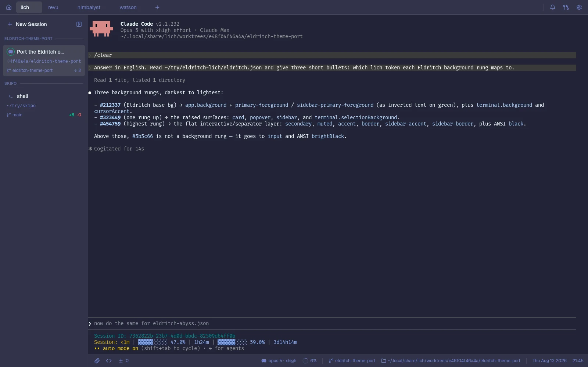
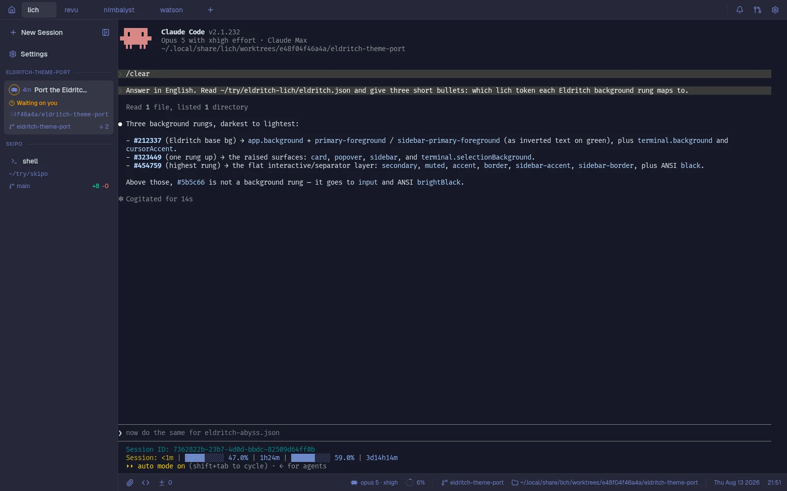
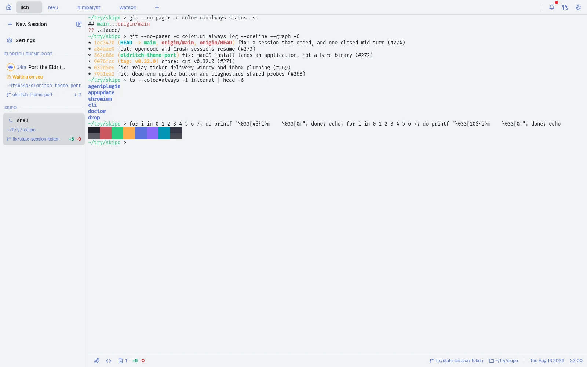

<!-- DO NOT CHANGE THIS -->

  

  Eldritch is a community-driven dark theme inspired by Lovecraftian horror. With tones from the dark abyss and an emphasis on green and blue, it caters to those who appreciate the darker side of life.

Main Theme repo can be found [here](https://github.com/eldritch-theme/eldritch)

### Showcase

    
🦑 Cthulhu (Default)

    

    
🌀 Abyss (Darker)

    

    
🌅 Dusk (Light)

    

### Installation

[lich](https://github.com/omartelo/lich) installs a theme repository from its
URL — nothing to download or copy by hand:

1. Open lich and go to **Settings → Appearance**.
2. Next to **Theme**, click **Import**.
3. Paste `https://github.com/omartelo/eldritch-lich` and click **Install**.
4. Pick a variant in the theme picker. The terminal picker defaults to
   **Match app**, so one pick dresses the interface and the terminal panes
   alike — or choose a different variant there if you want them to differ.

Later releases are taken with **Update** on the theme's row.

### Variants

| Theme | Upstream palette | `id` | `scheme` |
|---|---|---|---|
| Eldritch | 🦑 Cthulhu | `eldritch` | dark |
| Eldritch Abyss | 🌀 Abyss | `eldritch-abyss` | dark |
| Eldritch Dusk | 🌅 Dusk | `eldritch-dusk` | light |

### How the palette maps

The upstream [color specification](https://github.com/eldritch-theme/eldritch/blob/master/SPEC.md)
names four background rungs; lich's surface tokens take them as an elevation
ladder, so the chrome stays dark instead of drifting to mid-grey:

| Eldritch | lich |
|---|---|
| `background` | `background` — the app ground |
| `currentline` | `card`, `popover`, `sidebar` — tabs, footer, dock, menus, dialogs |
| `surface` | `accent`, `secondary`, `muted`, `border` — hover and selected fills, hairlines |
| `overlay` | `input` — control edges |
| `comment` | `muted-foreground` — secondary text, paths, resting icons |
| `green` | `primary` — the one high-emphasis fill, per the spec's *focus / active* role |
| `red` | `destructive` |
| `green` | `tone-pass`: "passed" in the status line |
| `yellow` | `tone-wait`: "waiting on you" |
| `cyan` | `ring` — the focus ring; kept off `primary` so a focused green button still shows one |

Dusk shifts the ladder one rung down (`currentline` is the canvas, `background`
is the chrome), the way lich's own light theme mirrors the depth of its dark one.

The terminal palettes follow the upstream
[Alacritty port](https://github.com/eldritch-theme/alacritty), which carries all
three variants.

#### Dusk legibility notes

Neon on near-white is a losing fight, so the light variant swaps a few slots for
their darker siblings from the Abyss palette — same family, readable at body
size:

- `black` / `brightBlack` are dark (`#1e2029`, `#5b5c66`) rather than near-white,
  or every dim TUI line would vanish into the background.
- terminal `red`, `green` and `cyan` take the Abyss values; `destructive` takes
  the Abyss red for the same reason.
- `ring` is purple, which the spec prescribes for Dusk text roles where green and
  cyan are decorative only.
- `tone-pass` (`#1a744a`) and `tone-wait` (`#995500`) are the Eldritch green and
  orange with their lightness lowered. The status line sets them at 12px, where
  WCAG asks 4.5:1, and the upstream values read 1.66:1 and 1.45:1 on Dusk's light
  canvas. Hue and saturation are untouched; Cthulhu and Abyss take the upstream
  values as they are.

### Thanks to

- [omartelo](https://github.com/omartelo) — port author
- [Eldritch contributors](https://github.com/eldritch-theme) — original palette

### Contributing

Each variant is one lich theme file — `eldritch.json`, `eldritch-abyss.json`,
`eldritch-dusk.json` — beside the `lich-theme.json` manifest that carries the
pack's version. There is no generator: colors are edited directly in the theme
files.

To propose a tweak:

1. Fork the repo.
2. Edit the relevant variant file.
3. Validate the **whole directory** — a repository installs all or nothing:
   `node validate.mjs .` (ships with the lich `theme` skill).
4. Bump `version` in `lich-theme.json` in the same commit. An unbumped version
   ships nothing: **Update** compares only that number.
5. Open a PR.

Palette reference: [eldritch-theme/eldritch](https://github.com/eldritch-theme/eldritch).

### License

[MIT](./LICENSE)
